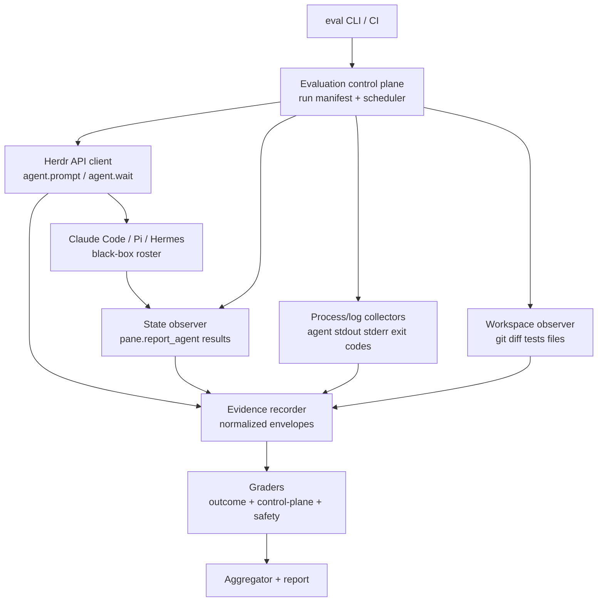

# Corrected Herdr Integration Guidance

## Short answer

**Yes: my earlier design assumed an observability surface that herdr does not expose.** With only `agent.prompt`, `agent.wait`, and `pane.report_agent`, the evaluator cannot passively intercept raw inter-agent JSON-RPC traffic because that traffic is not available as a stream.

The design should therefore be corrected in two ways:

1. Treat herdr as a **black-box coordination controller** whose externally observable contract is: prompts sent, waits performed, reported pane states, process lifecycle, workspace changes, and final outcomes.
2. Collect richer evidence at the **edges**—the evaluator’s own calls into herdr, each agent’s terminal/process output where available, the shared workspace and git history, and explicit instrumentation that agents voluntarily emit—not by pretending to observe internal messages that herdr does not provide.

That is still sufficient for a strong reliability lab. It changes the claims you can make: you can measure coordination outcomes and externally visible behavior, but you cannot honestly claim complete internal message-level tracing unless you add a new herdr feature or instrument the agents separately.

## What the documented API permits

| Primitive | What the harness can observe | What it cannot infer reliably |
|---|---|---|
| `agent.prompt` | Which pane received a prompt, when it was sent, whether the call returned, and optionally the state observed while waiting | The agent’s hidden reasoning, messages it sends elsewhere, or whether a response was internally forwarded through another path |
| `agent.wait` | Which pane was observed, when it was observed, and the returned state | Every intermediate transition between observations, unless polling happens to catch them |
| `pane.report_agent` | The state an integration reports upward, timestamped with the report receipt | Whether the reported state accurately reflects all internal work or communication |

The evaluation harness should explicitly label these as **control-plane events** and **reported-state events**, not as full agent transcripts.

## Corrected architecture



The harness remains outside herdr. The difference is that the `HerdrAdapter` is no longer described as a raw event-stream subscriber. It is a **command/observation adapter**.

## The corrected HerdrAdapter

The adapter should wrap every call made by the evaluator and record the request, response, timing, and correlation identifiers.

```ts
export type HerdrControlEvent = {
  runId: string;
  eventId: string;
  timestamp: string;
  operation: "agent.prompt" | "agent.wait" | "pane.report_agent";
  paneId?: string;
  request: Record<string, unknown>;
  response?: Record<string, unknown>;
  durationMs: number;
  error?: { name: string; message: string };
};

export interface HerdrAdapter {
  prompt(input: {
    runId: string;
    paneId: string;
    text: string;
    waitForState?: string;
    timeoutMs?: number;
  }): Promise<HerdrControlEvent>;

  wait(input: {
    runId: string;
    paneId: string;
    desiredState?: string;
    timeoutMs?: number;
  }): Promise<HerdrControlEvent>;

  observeReportedState(input: {
    runId: string;
    paneId: string;
  }): Promise<HerdrControlEvent>;
}
```

The adapter should not synthesize events such as `handoff_completed` unless that is directly represented by a returned API response or a separate observable fact. Use precise names such as:

```text
herdr.prompt.sent
herdr.prompt.returned
herdr.wait.started
herdr.wait.returned
herdr.pane_state.observed
herdr.api.error
```

If a prompt asks Agent A to coordinate with Agent B, record the prompt as an instruction—not as proof that a handoff occurred. Proof requires an observable event such as a later evaluator-issued prompt, a reported state transition, an agent-produced artifact, or a message written to a shared task log.

## What can be collected without new herdr features

### 1. Evaluator-issued control events

Every invocation of the three primitives is fully recordable by the client making the call. Capture the target pane, payload hash, request timestamp, response timestamp, returned state, timeout, and error. This gives you a reliable trace of what the evaluation harness requested and what herdr acknowledged.

Do not store sensitive prompt content in the primary metrics stream if it is large. Store the full request in an artifact and keep a content hash plus summary in the event index.

### 2. Reported state observations

Poll or wait for state transitions using `agent.wait`, and capture each returned state with its observation time. The result is a sampled state timeline, not an exact internal event timeline. Your report should call it `observed_state_timeline` and include the polling interval or wait policy.

The evaluator can measure useful things here: time to first ready state, time to completion, repeated state oscillation, timeouts, stale-state duration, and whether a pane ever reached a terminal state.

### 3. Agent process output

If Claude Code, Pi, and Hermes are launched by processes you control, collect their stdout, stderr, exit code, start/stop timestamps, and wrapper-level metadata. This is not raw herdr traffic, but it may contain useful agent-visible output and explicit tool results.

If an agent is launched entirely inside a terminal multiplexer and its output is not available through a supported integration, do not claim to have collected it. Use the workspace and control-plane evidence instead, or add a small wrapper around the process launch.

### 4. Workspace and repository evidence

The strongest evidence remains external to herdr: final git diff, changed paths, file hashes, test/typecheck/lint/build outputs, process exit status, and snapshots of relevant files. Take the final snapshot only after all agent processes have stopped.

This lets you answer whether the task was completed correctly even when internal coordination is opaque.

### 5. Voluntary agent-side instrumentation

You can ask each agent integration to write structured progress records to a run-scoped append-only file or local Unix socket:

```json
{"run_id":"r-123","agent":"hermes","kind":"task_started","task":"ts-001","timestamp":"..."}
{"run_id":"r-123","agent":"pi","kind":"handoff_intent","to":"claude","summary":"verify tests","timestamp":"..."}
{"run_id":"r-123","agent":"claude","kind":"work_completed","artifact":"test-log","timestamp":"..."}
```

This is useful, but it is **self-reported evidence**. Label its provenance as `agent_reported`, keep it separate from `harness_observed`, and never use it as the sole proof of a handoff or successful action.

A particularly good convention is a shared `run-events.jsonl` file with one line per explicit milestone. The file should be append-only, run-scoped, and written by wrappers or integrations rather than by the agent’s natural-language output.

## What requires a herdr change

A true raw inter-agent trace requires one of the following capabilities, none of which should be assumed to exist today:

| Desired capability | Required herdr support |
|---|---|
| Observe every internal message | Event subscription or socket tap for inter-agent traffic |
| Correlate causality precisely | Message IDs, parent IDs, sender/recipient, timestamps, and delivery status |
| Measure internal retries | Retry events emitted by the coordinator or agent integrations |
| Inspect exact pane transitions | State-change stream rather than polling-only observation |
| Capture tool-level semantics | Agent integrations emitting structured tool-call events |

If you later add such a feature, implement it as an optional `HerdrEventStream` capability. The evaluator should detect capabilities at startup and enrich the trace when available; it should not require them for the MVP.

```ts
export type HerdrCapabilities = {
  controlPrimitives: ["agent.prompt", "agent.wait", "pane.report_agent"];
  eventStream: boolean;
  structuredAgentLogs: boolean;
  stateChangeStream: boolean;
};
```

This makes the limitation itself testable and visible in reports:

```json
{
  "observability": {
    "herdr_event_stream": false,
    "structured_agent_logs": true,
    "state_change_stream": false,
    "trace_completeness": "edge_observed"
  }
}
```

## The fallback trace model

Use provenance on every evidence record.

```ts
export type EvidenceEnvelope = {
  runId: string;
  sequence: number;
  timestamp: string;
  source:
    | "harness"
    | "herdr_api_observed"
    | "pane_state_observed"
    | "process_observed"
    | "workspace_observed"
    | "agent_reported"
    | "grader_derived";
  kind: string;
  subject?: string;
  payload: Record<string, unknown>;
  confidence: "direct" | "sampled" | "self_reported" | "derived";
};
```

For example, a report may state:

> The evaluator observed that Hermes was prompted at 10:00:01, Pi reported `working` at 10:00:04, and the final workspace passed all tests at 10:04:12. The evaluator did **not** observe the internal message that caused Pi to begin work.

That is more credible than fabricating an apparent complete trajectory.

## Does a 3+ agent roster change the control plane?

**No fundamental change is required.** The control plane should model agents as a dynamic roster of named adapters or panes, not as hard-coded roles such as “planner” and “implementer.” Adding Hermes beside Claude Code and Pi should be a configuration change:

```yaml
roster:
  - id: claude
    pane_id: %claude
    integration: claude-code
  - id: pi
    pane_id: %pi
    integration: pi
  - id: hermes
    pane_id: %hermes
    integration: hermes
```

The task manifest should define the allowed roster and role hints, but the evaluator should record actual participation rather than assuming every agent contributed. This lets you compare a three-agent run with a two-agent run on the same task.

The control plane should track:

| Field | Purpose |
|---|---|
| `roster_config_id` | Identifies the exact pane/integration configuration. |
| `active_agents` | Agents that received at least one evaluator-issued prompt or produced an observable report. |
| `prompt_count_by_agent` | Shows coordination fan-out. |
| `observed_state_duration_by_agent` | Shows waiting/working/terminal behavior when states are available. |
| `agent_reported_artifacts` | Separates self-reported contributions from externally verified changes. |
| `workspace_contribution` | Uses diff or artifact evidence to determine actual effect, not claimed role. |

Do not make the grader assume that “more agents” is better. Extra agents can improve reliability, add latency, duplicate work, or create conflicting edits. The benchmark should measure those tradeoffs.

## Does the swap test still hold?

Yes, but it needs a slightly more precise statement:

> You should be able to replace the herdr adapter with a single-agent adapter while keeping the task registry, sandbox executor, evidence schema, graders, aggregator, and report format unchanged.

The adapter contract is the important seam. The single-agent adapter does not need to reproduce herdr’s internal semantics. It only needs to receive the same task prompt, operate in the same workspace policy, emit comparable process/workspace evidence, and terminate under the same supervision rules.

What will not be directly comparable is internal coordination telemetry. For a solo run, there are no inter-agent handoffs; for herdr, there are evaluator-observed prompts/waits and possibly agent-reported milestones. The report should therefore use separate metric families:

```text
common_outcomes:
  - task_pass
  - tests_pass
  - typecheck_pass
  - scope_violation
  - wall_time
  - estimated_cost

coordination_metrics:
  - evaluator_prompt_count
  - evaluator_wait_count
  - observed_state_transitions
  - active_agent_count
  - self_reported_handoff_count
```

The common outcomes support fair comparison. Coordination metrics explain the result but should not be mixed into the primary correctness score.

## What should the baseline actually be?

Use **both** a fixed reference baseline and per-agent solo baselines. They answer different questions.

### Baseline A: fixed reference agent

Choose one stable, documented configuration as the primary reference—for example, Claude Code with a pinned model/configuration and no herdr coordination. Run it on every task and trial. This gives the project a stable denominator for regression comparisons and makes the README easy to understand.

The fixed reference should be chosen for stability and availability, not because it is expected to be the best. Pin the model name, relevant flags, prompt wrapper, tool permissions, timeout, repository commit, and harness commit.

### Baseline B: solo baseline for each agent type

Run Claude Code, Pi, and Hermes independently under the same task and sandbox conditions. This answers whether herdr’s roster adds value compared with the agents it coordinates.

The minimum useful experiment matrix is:

| Configuration | Purpose |
|---|---|
| `reference-single` | Stable headline comparison. |
| `claude-solo` | Isolates Claude Code’s capability. |
| `pi-solo` | Isolates Pi’s capability. |
| `hermes-solo` | Isolates Hermes’s capability. |
| `herdr-claude-pi-hermes` | Measures the full roster. |
| Optional pairwise runs | Identifies whether a particular agent adds value or overhead. |

Do not compare only `herdr` against “the best single agent.” That creates selection bias and hides whether the roster is useful because of coordination or simply because one member is stronger. Report the best solo result as an upper-bound comparator, but preserve each solo result separately.

A good summary table is:

| Run family | Task pass rate | Median time | Median cost | Scope violations | Interpretation |
|---|---:|---:|---:|---:|---|
| Reference single |  |  |  |  | Stable denominator |
| Claude solo |  |  |  |  | Agent capability |
| Pi solo |  |  |  |  | Agent capability |
| Hermes solo |  |  |  |  | Agent capability |
| Herdr roster |  |  |  |  | Coordination system |

## Recommended scoring policy

Keep the primary score outcome-based and weighted toward deterministic correctness:

```text
primary_score =
  0.55 * required_behavior_pass
+ 0.20 * regression_tests_pass
+ 0.10 * typecheck_and_build_pass
+ 0.10 * scope_and_policy_pass
+ 0.05 * truthful_completion_or_safe_abstention
```

Treat coordination as diagnostic rather than as a hidden bonus. A three-agent run should not win merely because it generated more activity. If you want a cost/reliability frontier, report it separately:

```text
reliability_frontier = task_pass_rate versus median_cost_and_wall_time
```

This allows a simpler solo agent to beat herdr on efficiency while herdr wins on difficult-task reliability—a much more interesting engineering result than a single blended score.

## Updated MVP

The corrected MVP should be:

1. A `HerdrAdapter` that records only evaluator-issued `agent.prompt` and `agent.wait` calls plus returned states.
2. A process wrapper for each of Claude Code, Pi, and Hermes that captures stdout, stderr, exit status, and optional structured self-reports.
3. A workspace observer that records diffs, changed paths, tests, typechecks, and final state.
4. Evidence envelopes with provenance and confidence.
5. One fixed reference single-agent run, three solo agent runs, and one full three-agent herdr run.
6. A report that explicitly states that raw inter-agent traffic was not observed.

This is not a weakness in the project. It is a good systems-engineering constraint. A polished report can demonstrate that you understand observability boundaries and refuse to overclaim.

## Bottom line

The corrected design does **not** need a herdr feature that does not exist. It needs a narrower adapter and more honest evidence taxonomy. Herdr remains valuable as the coordination system under test, while the harness measures what it can actually observe: issued coordination commands, reported states, process behavior, workspace outcomes, and grader results.

For the roster, keep the control plane roster-agnostic and make Hermes another configured agent. For baselines, use one fixed reference configuration for headline comparisons **plus** a solo run for every agent type. The swap test still holds cleanly at the adapter boundary, provided the claims are framed around common outcomes rather than nonexistent internal message traces.

*Prepared by Manus AI.*
